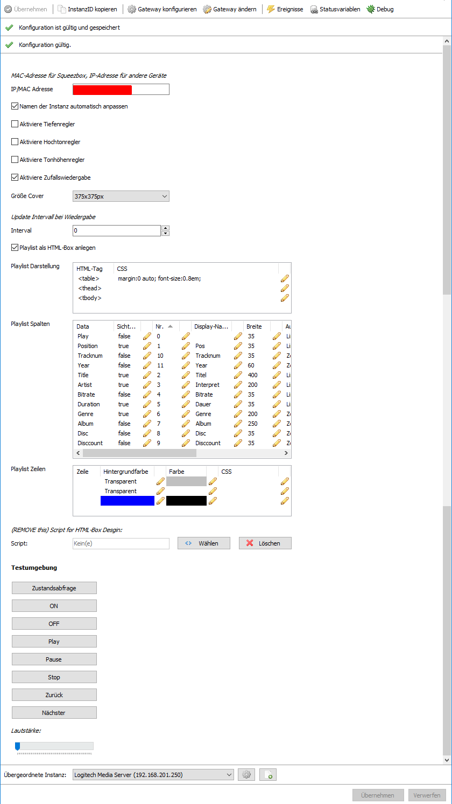
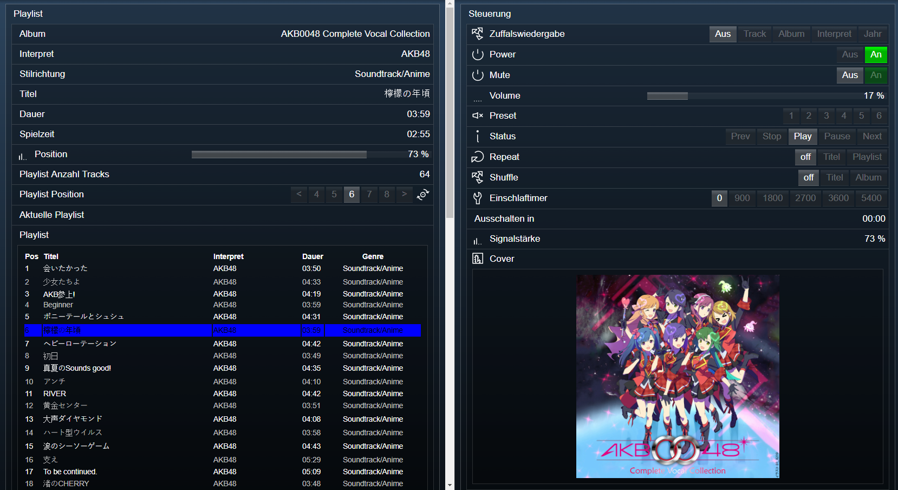

# SqueezeBox Player (SqueezeBoxDevice)
Ermöglich die Steuerung sowie die Darstellung der Zustände
von SqueezeBox Geräten in IPS, in Verbindung mit dem
Logitech Media Server.

## Dokumentation

**Inhaltsverzeichnis**

1. [Funktionsumfang](#1-funktionsumfang)  
2. [Voraussetzungen](#2-voraussetzungen)  
3. [Software-Installation](#3-software-installation)  
4. [Einrichten der Instanzen in IP-Symcon](#4-einrichten-der-instanzen-in-ip-symcon)  
5. [Statusvariablen und Profile](#5-statusvariablen-und-profile)  
6. [WebFront](#6-webfront)  
7. [PHP-Befehlsreferenz](#7-php-befehlsreferenz)   
8. [Anhang](#8-anhang)  
9. [Lizenz](#9-lizenz)

## 1. Funktionsumfang

 - Steuern und Abfragen der diversen verschiedenen Zustände und Eigenschaften.  
 - Abfragen, Laden, bearbeiten und speichern von der internen Playliste des Gerätes.  
 - Syncronisierung steuern.  
 - Fähigkeiten über das WebFront:  
    *  Modus: Play,Pause, Stop
    *  Audio: Lautstärke mit Stummschaltung, und wenn vom Gerät unterstützt, auch Tonhöhe sowie Höhen und Bass.
    *  Bedienung der 6 Preset-Tasten vom Gerät
    *  Sleeptimer: Setzen und löschen des Timer.
    *  Playlist: Trackanwahl, nächster, vorheriger Track, Widerholung und Zufallsmodus
    *  Darstellung der Daten zum aktuellen Track: Titel, Album, Interpret, Stilrichtung, Cover etc..
    *  Darstellen der Server-Playlisten sowie laden derselben auf Player.

## 2. Voraussetzungen

 - IPS 4.3 oder höher
 - Logitech Media Server (getestet ab 7.9.x)
 - kompatibler Player

## 3. Installation

 Dieses Modul ist Bestandteil der IPSSqueezeBox-Library.  
   *Über das 'Modul Control' folgende URL hinzufügen:  
    `git://github.com/Nall-chan/IPSSqueezeBox.git` 

## 4. Einrichten der Instanzen in IP-Symcon

Eine einfache Einrichtung ist über den Konfigurator [Logitech Media Server Konfigurator](../../LMSConfigurator/readme.md) möglich.  
Bei der manuellen Einrichtung ist die Instanz im Dialog 'Instanz hinzufügen' unter dem Hersteller 'Logitech' zufinden.  
  

**Konfigurationsseite:**  
  

| Name                                   | Eigenschaft       | Typ     | Standardwert | Funktion                                                              |
| :------------------------------------: | :---------------: | :-----: | :----------: | :-------------------------------------------------------------------: |
| IP/MAC-Adresse                         | Address           | string  |              | MAC Adresse der Squeezebox [Format xx:xx:xx:xx:xx:xx ]                |
| Namen der Instanz automatisch anpassen | changeName        | boolean | false        | Instanz automatisch umbenennen wenn der Name vom Gerät sich ändert.   |
| Aktiviere Tiefenregler                 | enableBass        | boolean | true         | Statusvariablen für Tiefenregler anlegen.                             |
| Aktiviere Hochtonregler                | enableTreble      | boolean | true         | Statusvariablen für Hochtonregler anlegen.                            |
| Aktiviere Tonhöhenregler               | enablePitch       | boolean | true         | Statusvariablen für Tonhöhenregler anlegen.                           |
| Aktiviere Zufallswiedergabe            | enableRandomplay  | boolean | true         | Statusvariablen für Zufallswiedergabe anlegen.                        |
| Größe Cover                            | CoverSize         | string  | cover        | Größe vom Cover:  cover  cover150x150  cover300x300                   |
| Update Interval bei Wiedergabe         | Interval          | integer | 2            | Abstand in welchen der LMS aktuelle Daten bei der Wiedergabe liefert. |
| Playlist als HTML-Box anlegen          | showPlaylist      | boolean | true         | Aktiviert die Darstellung der Playlist als HTML-Box.                  |
| Playlist Darstellung                   | Table             | string  | Tabelle      | Style Eigenschaften der Playlist HTML-Tabelle.                        |
| Playlist Spalten                       | Columns           | string  | Tabelle      | Style Eigenschaften der Playlist Spalten.                             |
| Playlist Zeilen                        | Rows              | string  | Tabelle      | Style Eigenschaften der Playlist Zeilen.                              |

## 5. Statusvariablen und Profile

Folgende Statusvariablen werden automatisch angelegt.
**Statusvariablen allgemein:**  

| Name                   | Typ     | Ident          | Beschreibung                                              |
| :--------------------: | :-----: | :------------: | :-------------------------------------------------------: |
| Player verbunden       | boolean | Connected      | True wenn der Player mit dem Server verbunden ist         |
| Power                  | boolean | Power          | Player ein- oder ausgeschaltet                            |
| Status                 | integer | Status         | Wiedergabemodus: Play, Pause, Stop                        |
| Preset                 | integer | Preset         | Aktionsbutton für das WebFront um einen Preset auszurufen |
| Mute                   | boolean | Mute           | Stummschaltung aktiv / deaktiv                            |
| Volume                 | integer | Volume         | Lautstärke                                                |
| Bass                   | integer | Bass           | Regler für Bass                                           |
| Hochtonregler          | integer | Treble         | Regler für Hochton                                        |
| Pitch                  | integer | Pitch          | Regler für Tonhöhen                                       |
| Zufallswiedergabe      | integer | Randomplay     | Modus der Zufallswiedergabe                               |
| Mischen                | integer | Shuffle        | Aktuelle Playlist mischen                                 |
| Wiederholen            | integer | Repeat         | Aktuelle Playlist wiederholen                             |
| Playlist Anzahl Tracks | integer | Tracks         | Aktuelle Anzahl der Tracks in der Playlist                |
| Playlist               | string  | Playlistname   | Name der Playlist oder Remote-Stream, sofern vorhanden    |
| Album                  | string  | Album          | Album des Tracks der aktuellen Wiedergabe                 |
| Titel                  | string  | Title          | Titel des Tracks der aktuellen Wiedergabe                 |
| Interpret              | string  | Artist         | Interpret des Tracks der aktuellen Wiedergabe             |
| Stilrichtung           | string  | Genre          | Stilrichtung des Tracks der aktuellen Wiedergabe          |
| Dauer                  | string  | Duration       | Spielzeit des Tracks der aktuellen Wiedergabe             |
| Spielzeit              | string  | Position       | Aktuelle Postion im Track als Klartext                    |
| Position               | integer | Position2      | Aktuelle Postion im Track in Prozent                      |
| Signalstärke           | integer | Signalstrength | WLAN-Signalstärke des Players, sofern vorhanden           |
| Einschlaftimer         | integer | SleepTimer     | Gewählter Zeitraum für Einschlaftimer                     |
| Ausschalten in         | string  | SleepTimeout   | Zeit bis zum Auschalten                                   |
| Playlist               | string  | Playlist       | HTML-Box mit der Playlist des Players                     |

**Profile**:

| Name            | Typ     | verwendet von Statusvariablen |
| :-------------: | :-----: | :---------------------------: |
| LSQ.Status      | integer | Status                        |
| LSQ.Intensity   | integer | Alle 0-100 Slider             |
| LSQ.Pitch       | integer | Pitch                         |
| LSQ.Shuffle     | integer | Shuffle                       |
| LSQ.Repeat      | integer | Repeat                        |
| LSQ.Preset      | integer | Preset                        |
| LSQ.SleepTimer  | integer | SleepTimer                    |
| LSQ.Randomplay  | integer | Randomplay                    |
| LSQ.Tracklist.* | integer | Tracks                        |

## 6. WebFront

Die direkte Darstellung im WebFront ist möglich, es wird aber empfohlen mit Links zu arbeiten.  
  

Hier ein Beispiel mit einer Splitpane und zwei Dummy-Instanzen (Playlist & Steuerung) welche Links zu den Statusvariablen und dem Cover enthalten.  
  

## 7. PHP-Befehlsreferenz

Für alle Befehle gilt:  
Tritt ein Fehler auf, wird eine Warnung erzeugt.  
Dies gilt auch wenn ein übergebender Wert für einen Parameter nicht gültig ist, oder außerhalb seines zulässigen Bereiches liegt.  

FOLGT

## 8. Anhang

**Changlog:**  

Version 1.0:  
 - Erstes offizielles Release

## 9. Lizenz

  IPS-Modul:  
  [CC BY-NC-SA 4.0](https://creativec
